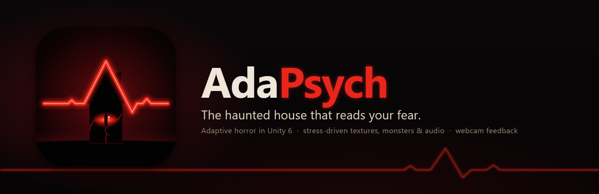
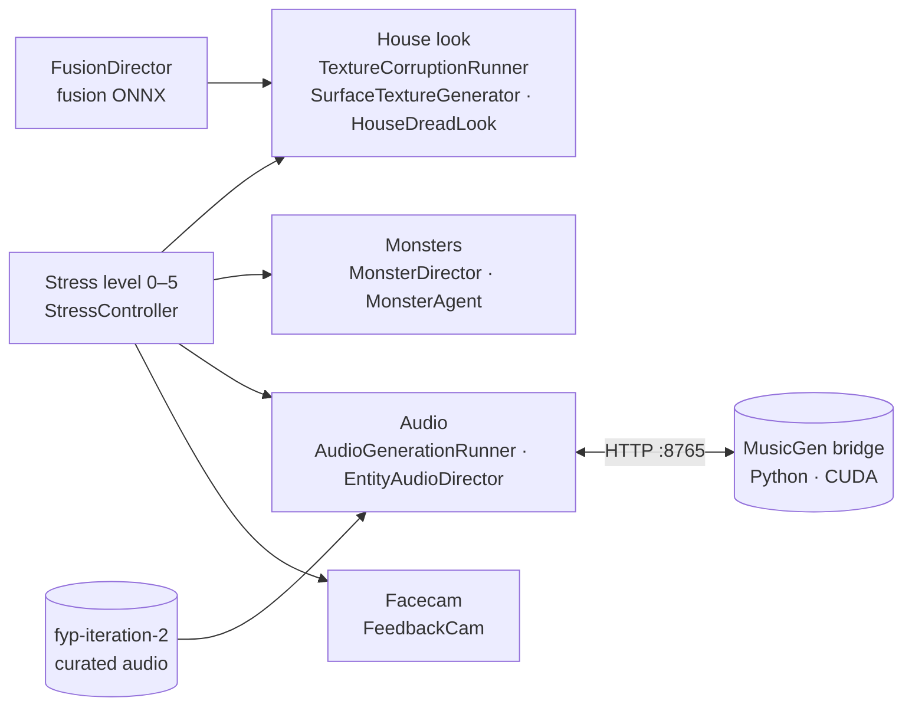

<p align="center">
  
</p>

<p align="center">
  
  
  
  
  
  
</p>

**AdaPsych** is a first-person horror game in which the haunted house adapts to how scared you are. A stress level
from **0 (calm)** to **5 (terrified)** reshapes everything you see and hear: the walls are regenerated, monsters
hunt you through three floors and a basement, the soundtrack darkens, and a live facecam turns against you. At
stress 5 the house bleeds.

---

## Features

- **A house that changes with you.** Every change in stress generates new surface textures. The iteration-2 texture
  U-Net is applied to a curated library of CC0 materials, with grime, cracks, blood, scorch, growth and TV-static
  corruption layered on per surface.
- **Stress 5: "you know you're done."** The whole house turns dark and red under flickering red lights, and is covered
  in glowing cracks and blood. The cracks and blood are generated again on every visit to stress 5, so they are never
  in the same place twice.
- **Seven monsters.** Rigged, animated monsters patrol and chase on a baked NavMesh, spawned at random by a director.
  At stress 5 each one is painted with pulsing red fissures and blood as it appears.
- **Adaptive audio.** Hand-curated ambience per stress level, per-monster sounds, and optional live music generation
  with Meta's MusicGen on the GPU, through a local bridge the game starts by itself.
- **The facecam.** Your webcam feed sits in the corner and gets tampered with. Face detection and segmentation run
  locally; frames stay on the GPU and are never stored or sent anywhere.

## How it works



## Getting started

**Requirements:** Windows · Unity **6000.5.7f1** · Git. For live MusicGen, optionally: an NVIDIA GPU and Python 3.10+
with a CUDA build of PyTorch.

```powershell
git clone https://github.com/sameerasif189/fyp-horror-unity.git
cd fyp-horror-unity
powershell -ExecutionPolicy Bypass -File .\setup_deps.ps1
```

`setup_deps.ps1` clones [`fyp-iteration-2`](https://github.com/sameerasif189/fyp-iteration-2) into
`fyp iteration 2\`, which holds the MusicGen bridge and the curated audio. It also downloads the MusicGen weights
(~2.3 GB). Add `-SkipMusicGenWeights` to skip them; the game plays the curated clips either way. Re-run it whenever
the audio changes.

Then open the folder in **Unity Hub**, load `Assets/Scenes/SampleScene.unity` and press **Play**.

> **Setting this up with an AI agent, or on a new machine?** [`AGENTS.md`](AGENTS.md) has the full step-by-step
> setup, how to check that it worked, where every system lives, and the traps to avoid.

### Controls

| Input | Action |
|-------|--------|
| <kbd>W</kbd> <kbd>A</kbd> <kbd>S</kbd> <kbd>D</kbd> | Move |
| Mouse | Look |
| <kbd>Shift</kbd> | Sprint |
| <kbd>Space</kbd> | Jump |
| <kbd>Esc</kbd> | Unlock the cursor |
| <kbd>0</kbd> – <kbd>5</kbd> | Set the stress level (Calm → Terrified) |

### MusicGen (optional)

The editor starts the CUDA bridge on its own and replaces one that is stuck on the port. It is ready about 60 s
later; its log is `Logs/musicgen_bridge.log`. To run it by hand:

```powershell
cd "fyp iteration 2"
pip install -r requirements.txt      # plus the CUDA torch wheel for your GPU
python musicgen_unity_bridge.py --port 8765 --require-cuda
```

Health check: <http://127.0.0.1:8765/health> should report `"device":"cuda"`. If Python is not found, set
`MUSICGEN_PYTHON` to the full path of your `python.exe`.

## Project layout

| Path | Contents |
|------|----------|
| `Assets/Scripts/` | Gameplay, stress, texture generation and corruption, monsters, audio, facecam |
| `Assets/Scripts/Editor/HauntedHouseBuilder.cs` | Builds the house, wires the monsters and bakes the NavMesh into `SampleScene` |
| `Assets/FYP/Entities/` | The seven monsters (models, textures, animator controllers) |
| `Assets/FYP/Models/` | Fusion, texture and audio ONNX models (Unity Inference Engine) |
| `Assets/Resources/TextureDeck/` | The texture library the generator composes from |
| `Assets/Resources/FeedbackCam/` | Facecam shaders and the face / segmentation models |
| `docs/branding/` | Icon (SVG source + PNG), README banner, social preview |
| `fyp iteration 2/` | Clone of `fyp-iteration-2` (not tracked here): MusicGen bridge, generators, curated audio |

## Credits

**Monsters** — all [CC BY 4.0](https://creativecommons.org/licenses/by/4.0/), from Sketchfab:

| Monster | Model | Author |
|---------|-------|--------|
| Tillagemon | [Tillagemon Boss Skeleton](https://sketchfab.com/3d-models/tillagemon-boss-skeleton-5c83cdeb86404e63900c1d04f8b391fb) | Vasian-Digital3D |
| Illiakan | [Illiakan V1](https://sketchfab.com/3d-models/illiakan-v1-cf6339e74a154d74a29e63eb002caa75) | Vasian-Digital3D |
| The Rake | [The Rake](https://sketchfab.com/3d-models/the-rake-92898b04b24e4315b0673fcfe307f64e) | Sealife Fan 3 |
| Lying Figure | [Lying Figure - Silent Hill](https://sketchfab.com/3d-models/lying-figure-silent-hill-d69cd1299cf84d258582e915a2085b0c) | Kain Hunter (Polygons_Oh_My) |
| Morning Walk | [Morning Walk (Height) Rig](https://sketchfab.com/3d-models/morning-walk-height-rig-3ec29fb07c3348b38037429374b940b4) | NO.DONT.EAT.ME.CASEOH |
| Partygoer | [Partygoer entity 67 remake [Backrooms]](https://sketchfab.com/3d-models/partygoer-entity-67-remake-backrooms-2936f8e1045848b49203b51f060a243a) | Fog (fog_) |
| Finger Maiden | [The Finger Maiden (Rigged)](https://sketchfab.com/3d-models/the-finger-maiden-rigged-27fe95462c06444b9ec8620e50cbb2ae) | Dreaming In Alternation 27 |

**Also used**

- Surface textures: CC0 materials from [Poly Haven](https://polyhaven.com) and [ambientCG](https://ambientcg.com);
  Yughues Free Cobble / Flooring Materials and Simple Nature Pack from the Unity Asset Store.
- Audio: recordings from [Freesound](https://freesound.org). The number at the start of each file name is its
  Freesound sound ID.
- Music generation: [MusicGen small](https://huggingface.co/facebook/musicgen-small) by Meta (weights CC BY-NC 4.0).
- Facecam: MediaPipe BlazeFace (short range) and Selfie Segmentation models.
- Tooling: [PrimeTween](https://github.com/KyryloKuzyk/PrimeTween), [Unity-MCP](https://github.com/IvanMurzak/Unity-MCP),
  glTFast, Unity Inference Engine, AI Navigation.

## Related repositories

- [`fyp-iteration-2`](https://github.com/sameerasif189/fyp-iteration-2): the generators, model training, the MusicGen
  bridge and the curated audio.
